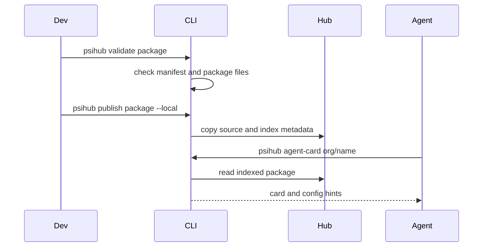

# Client

PsiHub's client surface is local-first: commands and Python APIs validate
packages, publish them to a local hub, download them, and render explanation
artifacts for humans and agents.

<div class="psi-tiles">
  <div class="psi-tile">
    <strong>CLI</strong>
    Initialize, validate, publish, list, fetch, and explain local packages.
  </div>
  <div class="psi-tile">
    <strong>Local Hub</strong>
    Deterministic `.psihub/packages` and `.psihub/index` storage.
  </div>
  <div class="psi-tile">
    <strong>Cards</strong>
    Human and agent-readable summaries generated from declared resources.
  </div>
  <div class="psi-tile">
    <strong>Config</strong>
    Local `.psi/config.toml` templates for services, tactics, channels, and
    stores.
  </div>
</div>

## Client Flow



## Typical Commands

```bash
psihub init demo-package --org demo --name echo --kind tactic
psihub validate demo-package
psihub --hub .psihub publish demo-package --local
psihub --hub .psihub card demo/echo
psihub --hub .psihub agent-card demo/echo
psihub --hub .psihub config-template demo/echo
```

## Runtime Boundary

PsiHub is not a runner. A card can name a FastAPI service entrypoint, preferred
port, tactic ref, channel store, or config key, but the user, script, AAAX, or
another runner decides what to start.

That boundary keeps the client predictable: package metadata remains passive,
portable, and safe to inspect.

## Next

- Use [Local Hub](../guides/local-hub.md) for storage behavior.
- Use [Cards And Agent Cards](../guides/cards.md) for explanation artifacts.
- Follow [Local Package Lifecycle](../tutorials/local-package-lifecycle.md)
  for a complete local workflow.
