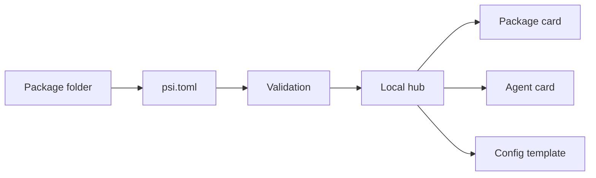

# PsiHub

PsiHub is the local-first package hub for PSI packages. It owns `psi.toml`,
validation, local publish/download, package cards, agent cards, and local
config templates.

PsiHub does not launch services. It makes packages understandable and
composable so humans, scripts, runners, and coding agents can decide how to run
them.

<div class="psi-tiles" markdown>
<div class="psi-tile" markdown>
**Validate**

Catch broken refs, entrypoints, run metadata, package-file paths, endpoint
metadata, and package shape before a package is shared.
</div>

<div class="psi-tile" markdown>
**Publish Locally**

Store normal package folders in deterministic `.psihub/packages` and
`.psihub/index` directories for development and tests.
</div>

<div class="psi-tile" markdown>
**Explain**

Render package cards, agent cards, and config templates from declared
resources so agents can inspect packages without guessing.
</div>
</div>

## Short Path

```bash
python -m pip install -e ".[dev,docs]"
psihub init demo-package --org demo --name echo --kind tactic
psihub validate demo-package
psihub --hub .psihub publish demo-package --local
psihub --hub .psihub card demo/echo
psihub --hub .psihub agent-card demo/echo
```

## Shape



The package folder remains ordinary source. Local publish copies it into the
hub while skipping secret/config/cache material. Local download returns another
ordinary folder with `psi.toml`, docs, examples, and assets intact.

## Boundary

PsiHub is a package hub, not an orchestrator. It can describe service
entrypoints, expected URLs, stores, ports, config keys, and `psi://` bindings,
but process launch belongs to humans, scripts, AAAX, or another runner.

That separation keeps package metadata passive. A package can say “this tactic
is served by `services.api`” or “this channel expects a local store” without
requiring PsiHub to start the service or own the store.

## Next

- Start with [Getting Started](getting-started.md).
- Learn package shape in [Packages](concepts/packages.md).
- Learn refs and local config in [Refs And Config](concepts/refs-and-config.md).
- Follow the [Local Package Lifecycle](tutorials/local-package-lifecycle.md).
