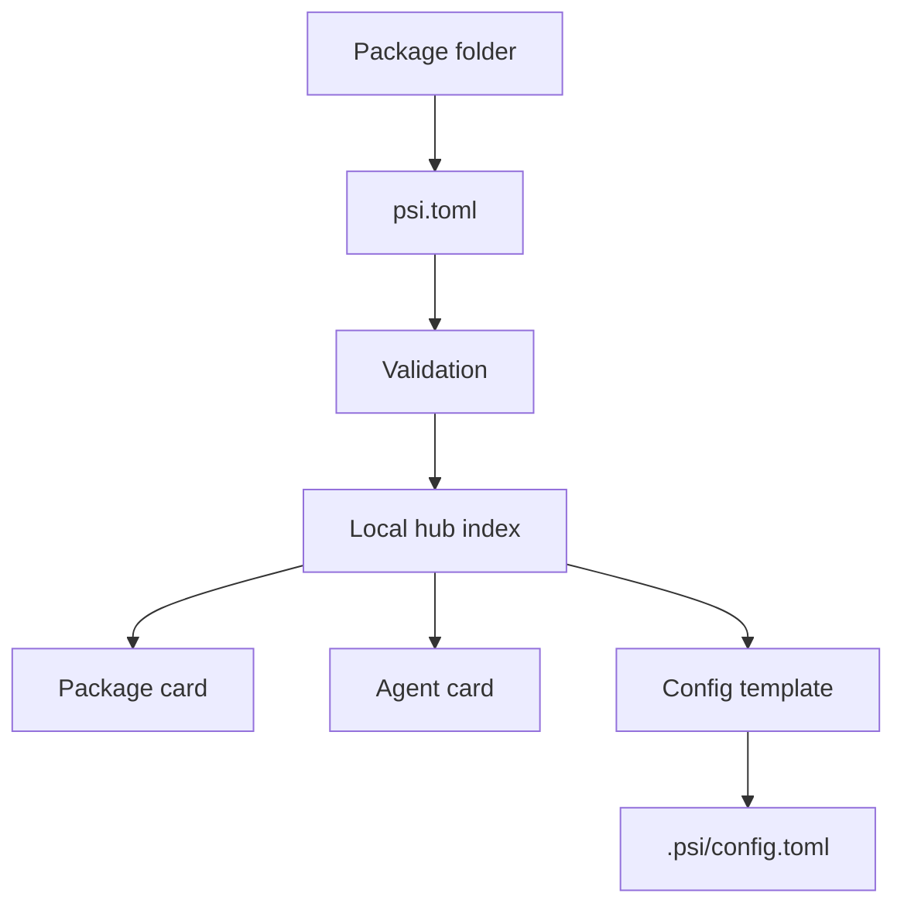

# Protocol

PsiHub's protocol is the passive package contract for PSI packages. It makes
`psi.toml` resources inspectable, validates refs and package-file paths, and
renders package cards, agent cards, and local config templates without
launching services.

  

    <strong>Package</strong>
    `org`, `name`, `version`, `kind`, primary resource, card metadata, and
    declared resources.
  

  

    <strong>Resource</strong>
    Schemas, tactics, services, channels, snapshots, docs, examples, assets,
    configs, and runs.
  

  

    <strong>Ref</strong>
    Stable `psi://org/name/resources/id` identity for local config and cards.
  

  

    <strong>Config</strong>
    Passive URL, store, path, service-port, and setting templates.
  

## Shape

## What The Protocol Owns

- package identity and version metadata,
- resource declarations and refs,
- package-file path validation,
- safe card and agent-card rendering,
- passive local config templates,
- package copy/download boundaries.

## What Stays Outside

- service launch,
- provider credentials,
- channel storage,
- tactic or model execution,
- deployment scheduling.

PsiHub can describe how a package should be understood. It does not decide how
or where the package is run.

## Next

- Read [Packages](../concepts/packages.md) for package shape.
- Read [Refs And Config](../concepts/refs-and-config.md) for binding rules.
- Read [Manifest](../reference/manifest.md) for the complete `psi.toml` shape.
